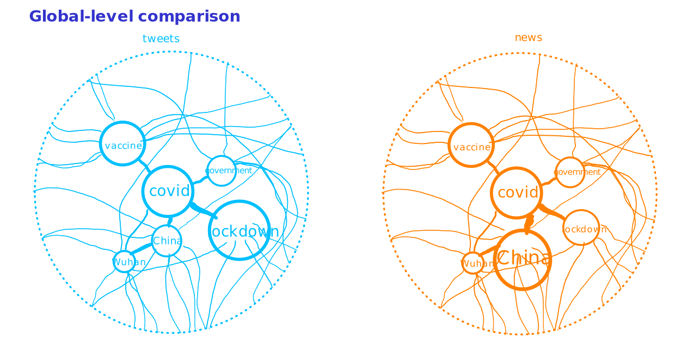

# Project of Data Visualization (COM-480)

| Student's name | SCIPER |
|----------------|--------|
| Polina Proskura | 328824 |
| Sophie du Couédic | 260007 |

[Milestone 1](#milestone-1) • [Milestone 2](#milestone-2) • [Milestone 3](#milestone-3)

## Milestone 1

**10% of the final grade**

### Main idea
Explore the words statistics in the news and tweets related to coronavirus. Find the topics, which affects people the most and how they are related to each other, display the lexical field used in the news compared to the lexical field used in the tweets.

### Dataset
We choose to unite several datasets concerning coronavirus, first of them with the news and second of them with the tweets of concerned people.

*News datasets*
- [Covid fake news Dataset](https://data.mendeley.com/datasets/zwfdmp5syg/1), by Abhishek Koirala
- [Covid fake news Dataset](https://zenodo.org/record/4282522#.YH0t0YMzaxB), by Sumit Banik
*Tweets datasets*
- [Covid19 Tweets](https://www.kaggle.com/gpreda/covid19-tweets), by Gabriel Preda

Note : the news dataset concerning covid are all trying to label fake/true news. In fact, fake news are really a concern during those times, but it is not our purpose to try to classify the news, so we will simply ignore the fake/true label.

### Problematic

There are a lot of concerning and debating news and discussions about covid. Some of them are spreading fake information, some of them just sending panic messages. We want to explore the statistics of the texts and find the most redundants topics/words appearing in the texts, to get a grasp of the mindset of the people living this pandemic : their feelings, their concerns. The idea is also to see how the news content compares to the tweets content, to see if the news relates closely or not to what the population is really experiencing. Are the news using the same lexical field to talk about coronavirus? The second idea is to search the topics/words that relate closely to one another by afferring pairs of words that often appear in the same tweet/news (for example if “anxiety” appears often with the word “lockdown”) and make a graph of the topics related to each other.

The visualisation in that case have two main purposes:
- To show to concerned people different new topics related to coronavirus to explore.
- To get of grasp of the semantic representation of coronavirus, and how it impacted the meaning of certain words that were before so irrelevant (today the word lockdown hits totally differently).
- See how the news and journalistic publication relates  to (and maybe influence as well) people feelings and concerns during such an important event.

### Exploratory Data Analysis

The analysis is available in Exploratory_Data_Analysis.ipynb file.
The text was cleaned, normalized and lemmatized.
There are data on most frequent words in the text and also most frequent bigrams, since there are topics strongly connected to each other.

### Related work

Previous works with the data:
- The news datasets were used to train the classifier to detect the fake covid news and do not grow the panic in the world [link](https://arxiv.org/abs/2011.03327).
- The tweets dataset was used to do some exploratory analysis, including the dynamics of the tweets depending on time and geography ([here](https://www.kaggle.com/gpreda/covid19-tweets/tasks?taskId=1505) and [here](https://www.kaggle.com/gpreda/covid19-tweets/tasks?taskId=1694)). Also, there was a classification task to predict if the tweet was positive or negative [link](https://www.kaggle.com/gpreda/covid19-tweets/tasks?taskId=1506).

Our approach: Our main idea is to visualize the words and phrases distributions among the texts.
First of all, we will see the image representing the frequency of every included topic and its significance in the texts.
The second idea is using text vectorization techniques to find the topics which are really close to each other in terms of covid and visualize that closeness, so we can detect really different topics concerning the people.

### Display inspiration
We were inspired by the visual display of the meToo [work](http://metoomentum.com/assets/rooting.jpg) presented during the lecture, and will try to display in a similar architecture the different topics related to coronavirus.

### Previous Courses
Polina have worked with some tweets datas on the ADA and ML courses, but not with this current dataset, should I provide my work?

## Milestone 2

> Include sketches of the vizualiation you want to make in your final product.

> List the tools that you will use for each visualization and which (past or future)
lectures you will need.

> Break down your goal into independent pieces to implement. Try to design a
core visualization (minimal viable product) that will be required at the end.
Then list extra ideas (more creative or challenging) that will enhance the
visualization but could be dropped without endangering the meaning of the
project.

> You should have an initial website running with the basic skeleton of the
visualization/widgets.

### Core visualization
Ideally, all all the visualization layouts will remain on the main page of the website. If implemented, the other visualizations will in some tables on the side that will be collapsed by default. We hope that the visualization will be self-exploratory enough, so we won't have the need to put some explanation on the main page, but in a secondary page if needed.

The core visualization consist of a network of topics, tweets and news. The tweets and news will be remain on an outter circle, with the different topics in the center of that circle. The tweets/news will be linked with their topics (possibly multiple topics per tweet or news) with very thin edges. The topics are linked to each others as well, with edge's thickness depending on how often two topics appear together.

#### Comparison between News and Tweets
Recall that the main goal is to compare the semantic fields used in the news and the tweets. Therefore we need a way to do this comparison, and we decided to propose two ways of comparing the two semantic universe, the user simply click on a button to switch from one way to the other :
* global-level comparison : we simply have the two networks side-by-side
* topic-level comparison : when the user has his mouse over one topic, display the differences between tweets and news for this topic

#### Number of topics
Let's consider the situation : we have hundreds of topics, and some are more important than others. If we want to keep all the topics in the page, then they would be illisible, but if we restrain only to the main topics it would not be very interesting. So we add a sliding button so the user can decide how many topics appear. The user can zoom in to see the topic labels.

### Extra features

#### Navigation/Recursion
On the top of simply zooming/dezooming and playing with the sliding button to have more/less topics, if possible we would like to provide a fancier way of navigating through the network. Intituively, each node of the network has his own subnetwork of topics. For example, subnetwork of `China` as root would probably consist of `Wuhan`, `government`, `America` topics (and so on). The idea is that if the user click on `China` from the original view, we recursively draw this subnetwork in the same way we did it with the overall network. The difficulty, is that now we need to have some hierarchy across the topics (child topics vs parent topics), and the parent-child relationships need to be derived from the statistics of the dataset.

#### Tweets vs. Fake News vs True News
We can simply adapt all the above to have three cathegories, namely `Tweets`, `Fake News`, `Correct News`. The datasets we use already have the correct labels.

#### Topic Chart && direct tweets/news listing
In a [previous section](#comparison-between-news-and-tweets), we explained that when the user's mouse is over a given topic node, we display the repartition between news and tweets for that topic. We can additionally, in a table below, provide more informations for that node, for example the frequency of apparition in news and in tweets. We can also see how strongly it is related to other topics.
In table on the side, we can list the first tweets and news related to the topic. The two table can be collapsed/expanded if the user wants to.

## Milestone 3 (4th June, 5pm)

**80% of the final grade**

## Late policy

- < 24h: 80% of the grade for the milestone
- < 48h: 70% of the grade for the milestone
